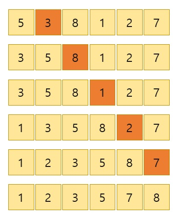

## 삽입정렬

알고리즘에 많은 유형 중 탐색과 정렬하는 것들이 많다.

> __정렬__  
데이터를 순서대로 나열하는 방법

+ 모든 데이터를 앞의 수에서부터 차례로 비교하여 자신의 위치에 삽입을 통해 정렬하는 방식
+ 구현하기 간단하다. 
+ 이미 정렬되어 있는 배열에 새로운 원소를 집어넣어 다시 정렬할 때는 새 원소를 처음부터 한번씩만 기존의 원소들과 비교하면 되므로 매우 효과적이다.
+ 배열이 길어질수록 효율이 떨어진다.(시간이 오래 걸린다)



```javascript
var insertionSort = function(array) {
    var i = 1, j, temp;
    for(i; i < array.length; i++) {
        temp = array[i];
        console.log('array[i]: ',array[i]);
        for(j = i - 1; j >= 0, temp < array[j]; j--) {
            array[j + 1] = array[j];
            console.log('j : ', j ,' array[j] : ',array[j]);
        }
        array[j + 1] = temp;
        console.log('temp: ',temp);
    }
    return array;
};

insertionSort([5, 6, 1, 2, 4, 3])
```

## 시간의 복잡도