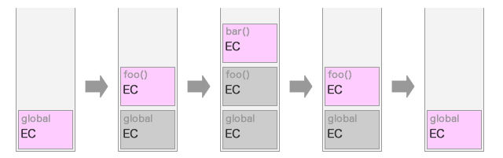
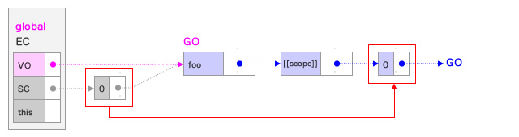

# Execution Context(실행 컨텍스트), EC

scope, hoisting, this, function, closure 등의 동작원리를 담고 있는 자바스크립트의 핵심원리이다.  

실행 가능한 코드 블럭이 실행되는 환경이다.

자바스크립트 엔진은 코드를 실행하기 위해 실행에 필요한 여러가지 정보(실행 환경)를 실행 컨텍스트라는 객체로 관리한다.

**실행 가능한 코드**
+ Global Code : 전역 영역에 존재하는 코드
+ Eval Code : Eval 함수로 실행되는 코드
+ Function Code : 함수 내에 존재하는 코드

> **eval(string)**  
문자열 파라미터로서 전달된 code 또는 표현식(expression)을 평가 또는 실행한다.  
사용자로 부터 입력받은 Contents(untrusted data)를 eval()로 실행하는 것은 보안에 매우 취약하다. 불필요한 eval()의 사용은 금지되어야 한다.

※ 일반적으로 실행 가능한 코드는 전역코드와 함수(Function code)가 된다.

**실행에 필요한 정보**
+ 변수
  - 함수 내부에서만 접근할 수 있는 지역변수
  - this를 통해 접근할 수 있는 객체의 프로퍼티
+ 매개변수(parameter)
+ 함수 선언
+ 변수의 유효범위(scope)
+ this

위 정보를 자바스크립트 엔진은 실행 컨텍스트<sup>Execution Context</sup>라는 또다른 객체 내에서 관리하게 된다.

```javascript
/////////// global context ////////////
var x = 'xxx';

function foo() {
/////////// execution context ////////////
  var y = 'yyy';

  function bar() {
    /////////// execution context ////////////
    var z = 'zzz';
    console.log(x + y + z); // xxxyyyzzz
    /////////////----------------/////////////
  }
  bar();
/////////////----------------/////////////
}
foo();
/////////////----------------/////////////
}
```

  
<sup>이미지 출처 : http://maeharin.hatenablog.com/entry/20130313/javascript_scopechain</sup>

1. 컨트롤이 실행 가능한 코드로 이동하면 논리적 스택 구조를 가지는 새로운 실행 컨텍스트 스택이 생성된다.  
스택의 FILO(First in Last out, 선입후출)원리에 의해 **현재 실행중인 컨텍스트는 스택의 최상위에 위치** 하게 된다.
2. Global code(전역 코드)로 컨트롤이 들어가면 **전역 실행 컨텍스트** 가 실행 컨텍스트 스택에 쌓인다.
3. 함수가 호출되면 **함수의 실행 컨택스트가 생성** 된다.  
컨트롤이 새로운 함수로 들어갈 때마가 그 함수의 실행 컨텍스트가 컨텍스트 스택에 쌓인다.
4. 함수 실행이 끝나면 해당 함수의 실행 컨텍스트를 파기하고 컨트롤을 이전 컨텍스트에 반환한다.

> **Execution context stack (ECS)**  
실행 컨텍스트 스택은 자바스크립트 코드를 실행하는 동안 생성된 모든 실행 스택을 저장하는 스택 데이터 구조이다.

  
<sup>이미지 출처 : https://hackernoon.com/execution-context-in-javascript-319dd72e8e2c</sup>

## 실행 컨텍스트 생성과정

실행 컨텍스트는 **Variable Object, Scope Chain, this value** 3가지 프로퍼티를 포함한다.

+ **Variable Object(VO / 변수 객체)**  
실행 컨텍스트가 생성되면 실행에 필요한 여러 정보들을 담기위해 자바스크립트 엔진이 생성한 객체이다.  
코드가 실행될 때 참조되며 프로그램에서는 접근할 수 없다.  
전역 컨텍스트에서 VO는 전역객체를 가리키며 유일하고, 최상위에 위치하며 모든 전역 변수, 전역 함수 등을 포함한다.  
함수 컨텍스트에서 VO는 Activation object(AO / 활성 객체)를 가리키며 인수들의 정보를 배열 형태로 담고 있는 객체인 arguments object와 매개변수가 추가된다.  
아래의 정보를 담는다.
  - 변수
  - 매개변수<sup>parameters</sup>와 인수<sup>arguments</sup>
  - 함수 선언<sup>Function Declaration.</sup> (Function Expression은 제외)
  
+ **Scope Chain(SC)**  
일종의 리스트로 중첩된 함수의 스코프(혹은 VO)의 레퍼런스를 차례로 저장하고 있는 개념이다.  
이 리스트로 현재 컨텍스트의 변수 뿐만 아니라 상위 실행 컨텍스트의 변수에도 접근이 가능하다.  
이 리스트에서 찾지 못한 변수는 결국 정의되지 않은 변수에 접근하는 것으로 판단되어 ReferenceError 에러를 출력한다.  
[[scope]] 프로퍼티로 참조할 수 있다.
+ **this value**  
현재 실행 컨텍스트를 포함하는 객체에 대한 레퍼런스이다.

<table>
	<tr><th colspan="2">Execution context</th></tr>
	<tr>
		<td>Variable object</td>
		<td>{ vars, function declarations, arguments... }</td>
	</tr>
	<tr>
		<td>Scope chain</td>
		<td>[Variable object + all parent scopes]</td>
	</tr>
	<tr>
		<td>thisValue</td>
		<td>Context object</td>
	</tr>
</table>

> **위 예제에 대한 컨텍스트 생성 과정**
> + Global Code에의 진입
>   - Scope Chain의 생성과 초기화
>   - Variable Instantiation 실행
>     * (Function Code인 경우) 매개변수(parameter)가 Variable Object의 프로퍼티로, 인수 rgument)가 값으로 set된다.
>     * 대상 코드 내의 Function Declaration(Function Expression 제외)를 대상으로   명이 Variable Object의 프로퍼티로, 생성된 Function Object가 값으로 set된다.
>     * 대상 코드 내의 Variable Declaration을 대상으로 변수명이 Variable Object의   퍼티로, undefined가 값으로 set된다.
>   - this value 결정
> + Global code의 실행
>   - 변수 값의 대입
>   - 함수 foo의 실행
>     * Scope Chain의 생성과 초기화
>     * Variable Instantiation 실행
>     * this value 결정
> + foo function code의 실행
>   - 변수 값의 대입
>   - 함수 bar의 실행
>     * Scope Chain의 생성과 초기화
>     * Variable Instantiation 실행
>     * this value 결정
> + bar function code의 실행

## 1. Global Code에의 진입

컨트롤이 실행 컨텍스트에 들어가기 전, 유일한 전역 객체(Global Object, GO)가 생성된다.  
전역객체 단일 사본으로 존재하며, 이 객체의 프로퍼티는 프로그램의 어떠한 곳에서도 접근할 수 있다.  
프로그램이 종료되면 전역객체의 라이프 사이클은 끝난다.

초기상태의 전역 객체에는 Built-in object(Math, String, Array 등)와 BOM(window 객체 등), DOM이 Set 되어있다.

전역 객체 생성 후, Global Code로 컨트롤이 이동하면 새로운 실행 컨텍스트가 스택에 쌓인다.  

  
<sup>전역객체 생성</sup>

  
<sup>Global Code로 컨트롤이 이동하면 새로운 실행 컨텍스트가 스택에 쌓인다</sup>

이후 이 실행 컨텍스트를 바탕으로 이하의 처리가 실행된다.
> 1. Scope Chain의 생성과 초기화
> 2. Variable Instantiation 실행
> 3. this value 결정

### 1.1. Scope Chain의 생성과 초기화

새로운 실행 컨텍스트에 들어가게 되면 우선 Scope Chain의 생성과 초기화가 실행된다.

> **Scope Chain**  
