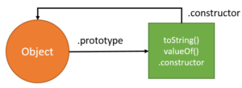
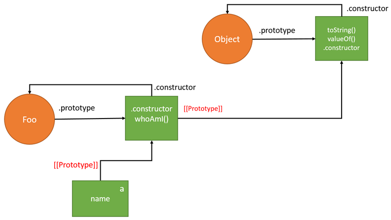
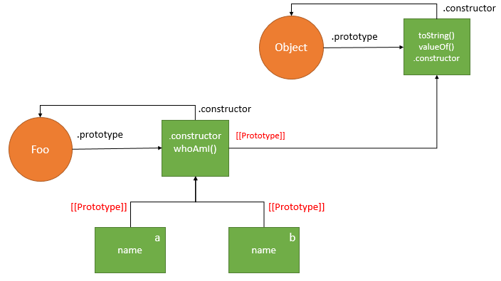
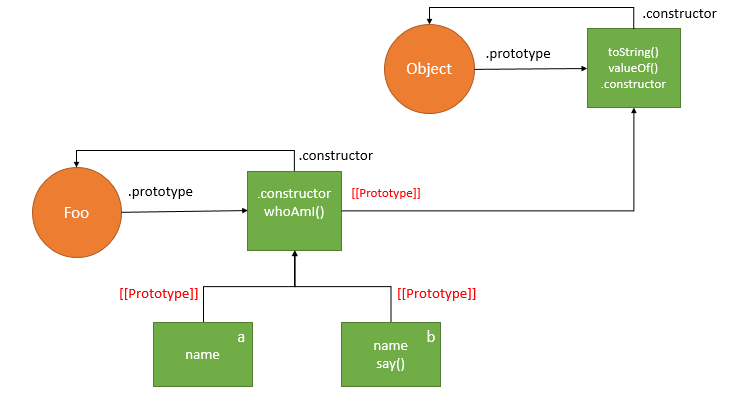

## 1. 프로토타입 객체

[참조 : poiemaweb](http://poiemaweb.com/js-prototype)  
[참조 : MDN](https://developer.mozilla.org/ko/docs/Web/JavaScript/Guide/%EA%B0%9D%EC%B2%B4_%EB%AA%A8%EB%8D%B8%EC%9D%98_%EC%84%B8%EB%B6%80%EC%82%AC%ED%95%AD#Class-based_vs._prototype-based_languages)

객체 생성 이전에 클래스를 정의하고 이를 통해 객체(인스턴스)를 생성하는  
다른 클래스 기반 객체지향 프로그래밍 언어와 달리  
자바스크립트는 _프로토타입 기반의 객체지향 프로그래밍_ 언어로  
클래스 없이도 (※ECMAScript6에서 클래스가 추가되었다.) 객체를 생성할 수 있다.

자바스크립트의 모든 객체는 자신의 부모 역할을 하는 객체와 연결 되어 있는데   
이는 객체 지향의 상속 개념과 같이 _부모 객체의 프로퍼티 또는 메서드를 상속받아 사용할 수 있게 한다._  
이러한 부모객체를 **Prototype(프로토타입) 객체** (줄여서 Prototype(프로토타입))이라고 한다.

> **ECMAScript spec**   
**자바스크립트의 모든 객체는 자신의 프로토타입을 가리키는 [[Prototype]]이라는 숨겨진 프로퍼티를 가진다.**


※ 크롬, 파이어폭스 등에서는 숨겨진 `[[Prototype]]` 프로퍼티가 `__proto__` 프로퍼티로 구현되어 있다.(둘은 같은 개념)

```javascript
var student =  {
    name: 'chi',
    score: 90
};

console.log(student.hasOwnProperty('name')); // true
console.log(student);                        // .... __proto__ : object ....

console.log(student.__proto__ === Object.prototype); // true
```

상속 개념에서 자바스크립트는 객체라는 생성체만을 가진다. 각 객체는 **프로토타입** 이라고 하는 다른  
객체에 대한 링크를 보유하고 있는 private property([[Prototype]]이라고 하는)를 가진다.

student 객체는 `__proto__` 라는 프로퍼티에 자신의 부모객체(프로토타입 객체)인 `Object.prototype`을 Link 하고 있다.

객체를 생성할 때 프로토타입은 결정된다. 결정된 프로토타입 객체는 다른 임의의 객체로 변경할 수 있다.  
이것은 부모 객체인 프로토타입을 동적으로 변경할 수 있음의 의미한다.  
이러한 특징을 활용하여 객체의 상속을 구현할 수 있다.

## 2. `[[Prototype]]` 프로퍼티 vs prototype 프로퍼티

**`[[Prototype]]` 프로퍼티**
+ 자신의 프로토타입 객체를 가리키는 숨겨진 프로퍼티
+ `__proto__` 프로퍼티로 구현되어 `__proto__`와 `[[Prototype]]`은 같은 개념이다.
+ 함수도 객체이므로 `[[Prototype]]` 프로퍼티를 갖는다. 일반 객체와 달리 prototype 프로퍼티도 소유한다.

> ※ prototype 프로퍼티와 `[[Prototype]]` 프로퍼티는 **모두 프로토타입을 가리키지만 관점의 차이가 있다.**

```javascript
// 생성자 함수 정의
function Person(name, gender) {
    this.name = name;
}

// new 연산자와 함께 생성자 함수 사용
var foo = new Person('chi'); 

console.dir(Person);  // { prototype: Object, __proto__: function () }
console.dir(foo);     // { __proto__: Object }

console.log(Person.__proto__ === Function.prototype);    // true
console.log(Person.prototype === foo.__proto__);         // true
console.log(Person.prototype.constructor === Person);    // true
```
| [[Prototype]] 프로퍼티 | prototype 프로퍼티 |
| ---- | ---- |
| 함수를 포함한 모든 객체가 가지고 있는 프로퍼티 | 함수 객체만 가지고 있는 프로퍼티 |
| **객체의 입장에서 자신의 부모 역할을 하는 프로토타입 객체를 가리키며 함수 객체의 경우 `Function.prototype`을 가리킨다.** | **함수 객체가 생성자로 사용될때 이 함수를 통해 생성된 객체의 부모 역할을 하는 객체를 가리킨다** |
| - | 함수가 생성될 때 만들어 지며 constructor 프로퍼티를 가지는 객체를 가리킨다. 이 constructor 프로퍼티는 함수 객체 자신을 가리킨다. |

## 3. Prototype chain

프로토타입 체인이란 특정 객체의 프로퍼티나 메서드에 접근하려고 할 때  
해당 객체에 접근하려는 프로퍼티 또는 메서드가 없다면 `[[Prototype]]` 프로퍼티가  
가리키는 링크를 따라 자신의 부모 역할을 하는 프로토타입 객체의 프로퍼티나 메서드를  
차례대로 검색하는 것이다.

```javascript
var student = {
    name: 'chi',
    scrore: 90
}
console.log(student.hasOwnProperty('name'));                    // true
console.log(Object.prototype.hasOwnProperty('hasOwnProperty')); // true
```

student 객체는 hasOwnProperty() 메서드를 가지고 있지 않지만 `[[Prototype]]` 프로퍼티가 가리키는 링크를 따라가서 student 객체의 부모역할을 하는 프로토타입 객체(Object.prototype)의 메서드 hasOwnProperty를 호출했기 때문에 에러 없이 정상적으로 결과가 출력되었다.

### 3.1. 객체 리터럴 방식으로 생성된 객체의 프로토타입 체인

객체 생성 방법 3가지 : 객체 리터럴, 생성자 함수, Object() 생성자 함수

JavaScript 엔진은 객체 리터럴로 객체를 생성하는 코드를 만나면 내부적으로  
**내장 함수(Built-in)인 Object() 생성자 함수를 사용하여 객체를 생성한다.**

> Object() 생성자 함수는 물론 함수다. (일반 객체와 달리 함수 객체는 prototype 프로퍼티가 있다.)

```javascript
var person = {
    name: 'chi',
    gender: 'female',
    sayHello: function() {
        alert('Hi! my name is ' + this.name);
    }
};

console.dir(person);

console.log(person.__proto__ === Object.prototype);             // true 
console.log(Object.prototype.constructor === Object);           // true
console.log(Object.__proto__ === Function.prototype);           // true
console.log(Function.prototype.__proto__ === Object.prototype); // true
```

### 3.2. 생성자 함수로 생성된 객체의 프로토타입 체인

함수 선언 방식 3가지 : 함수선언식, 함수표현식, Function() 생성자 함수

함수 선언식과 함수 표현식은 모두 함수 리터럴 방식으로 함수를 정의하는데  
이것은 결국 내장 함수 Function() 생성자 함수로 함수를 생성하는 것을 단순화 시킨것이다.

> 내장 함수 Function() 생성자 함수도 물론 함수이기 때문에 일반객체와 달리 prototype 프로퍼티가 있다.

```javascript
function Person(name, gender) {
    this.name = name;
    this.gender = gender;
    this.sayHello = function() {
        alert('Hi! my name is ' + this.name);
    };
}

var foo = new Person('chi', 'female');

console.dir(Person);
console.dir(foo);

console.log(foo.__proto__ == Person.prototype);                 // true 
console.log(Person.prototype.__proto__ === Object.prototype);   // true
console.log(Person.prototype.constructor === Person);           // true
console.log(Person.__proto__ === Function.prototype);           // true
console.log(Function.prototype.__proto__ === Object.prototype); // true 
```

**프로토타입 체인의 종점<sup>End of prototype chain</sup>**  
Object.prototype 객체

객체 리터럴 방식이나 생성자 함수 방식이나 결국 모든 객체의 부모 객체인 Object.prototype 객체에서 프로토타입 체인이 끝나기 때문에  
foo 객체의 프로토타입 객체 Person.prototype 객체와 Person() 생성자 함수의 프로토타입 객체인 Function.prototype의 프로토타입 객체는 Object.prototype 객체다. 

### 3.3. 이미지와 예제로 보는 프로토타입 개념정리 :star:

[참조 : JavaScript Prototype Explained By Examples]http://www.javascripttutorial.net/javascript-prototype/

JavaScript 엔진은 `Object()` 함수와 `Object.prototype`을 통해 참조 될 수 있는 익명 객체<sup>anonymous object</sup>를 제공한다.
```javascript
console.log(Object); // function Object() { [native code] }
console.log(Object.prototype); // Object { ... }
```

**`Object.prototype`** 객체에는 `toString()`, `vauleOf()` 등과 같은 내장 프로퍼티가 있다.  
또한 `Object()` 함수를 다시 가리키는 `constructor`라는 프로퍼티가 있다.
```javascript
console.log(Object.prototype.constructor === Object); // true
```

  
<sup>Object () 함수와 Object.prototype 객체 간의 관계  
(※ 그림에서 원은 함수이고 사각형은 객체다)</sup>

#### 1. `Foo`라는 함수를 다음과 같이 정의한다.  

`Foo()` 함수는 argument를 받아, 객체에 `name` property을 추가하고 argument를 `name` property의 값으로 설정한다.
```javascript
function Foo(name) {
    this.name = name;
}
```

이 뒤에서, JavaScript 엔진은 새로운 함수 `Foo()`와 익명객체를 만든다.  
`Foo()` 함수에는 익명 객체를 가리키는 **`prototype`** 이라는 속성이 있다.  
익명 객체는 `Foo()` 함수를 가리키는 `constructor` property를 가진다.

또한 `Foo.prototype` 객체는 프로토타입 link로 알려진 `[[Prototype]]`을 통해 `Object.prototype` 객체에 연결된다.  

![[[Prototype]]](../../asset/JavaScript-Prototype-Function-defined.png)  
<sup>prototype linkage : [[Prototype]]</sup>

#### 2. `Foo.prototype` 객체에 `whoAmI()` 라는 새 메서드를 추가한다.

```javascript
Foo.prototype.whoAmI = function() {
    return "I am " + this.name;
}
```
  
<sup>`whoAmI()`가 `Foo.prototype` 객체의 메서드로 추가되었다.</sup>

#### 3. `a`라는 `Foo` 객체의 새로운 instance를 생성한다.

```javascript
var a = new Foo('a');
```

내부적으로 JavaScript 엔진은 `a`라는 새로운 객체를 만들고, prototype linkage를 통해 객체를 `Foo.prototype` 객체에 연결한다.

  
<sup>`a`라는 새로운 객체가 prototype linkage를 통해 `Foo.prototype` 객체에 연결되었다.</sup>

`a`, `Foo.prototype` 및 `Object.protoype`간의 링크를 **프로토타입 체인** 이라고한다.

#### 4. `b`라는 `Foo` 객체의 또 다른 instance를 생성한다.

```javascript
var b = new Foo('b');
```

  
<sup>`b`라는 새로운 객체가 prototype linkage를 통해 `Foo.prototype` 객체에 연결되었다.</sup>

#### 5. `b` 객체에 `say()`라는 메서드를 추가한다.

```javascript
b.say = function() {
    consoel.log('Hi from ' + this.whoAmI());
}
```

  
<sup>JavaScript 엔진은 `say()` 메서드를 `Foo.prototype` 객체가 아닌 `b` 객체에 추가한다.</sup>

#### 6. 

다음과 같은 코드를 작성한다.
```javascript
consoel.log(a.constructor); // Foo
```

`a`는 `constructor` 프로퍼티를 가지지 않는데 어떻게 `Foo` 가 출력되는 것일까?  

JavaScript 엔진은 `constructor` 프로퍼티를 `a`에서 찾지 못하면 프로토타입 체인까지 올라와 찾는다.  `a` 객체는 prototype linkage를 통해 `Foo.prototype` 객체에 연결되고 `Foo.prototype`은 `constructor` 프로퍼티를 가지기 때문에, JavaScript 엔진은 `Foo`를 반환한다.  
그 결과 다음과 같은 코드는 `true`를 반환한다. 
```javascript
console.log(a.constructor === Foo); // true
```

마찬가지로 다음과 같은 코드에서 `a`객체에서 `whoAmI()` 메서드를 찾지 못하면 프로토타입 체인을 타고 올라와 찾기 때문에 `Foo.prototype` 객체의 해당 메서드를 찾아 실행했다.
```javascript
console.log(a.whoAmI()); // I am a
```

만약 다음과 같이 같은 이름의 메서드를 `a` 객체에 추가하면 JavaScript 엔진은 프로토타입 체인에서 찾지 않고 `a` 객체의 메서드를 실행한다. (shadowing)
```javascript
a.whoAmI = function() {
    console.log('This is ' + this.name);
}

console.log(a.whoAmI()); // This is a
```

## 4. 기본자료형<sup>Primitive data type</sup> 확장

>  Built-in object(내장 객체)의 Global objects (Standard Built-in Objects)인 String, Number, Array 객체 등이 가지고 있는 표준 메서드는 프로토타입 객체인 `String.prototype`, `Number.prototype`, `Array.prototype` 등에 정의되어 있다.  
이들 프로토타입 객체 또한 Object.prototype를 프로토타입 체인에 의해 자신의 프로토타입 객체로 연결한다.
>
> 자바스크립트는 표준 내장 객체의 프로토타입 객체에 개발자가 정의한 메서드의 추가를 허용한다.

기본자료형을 제외한 모든 것은 객체다.  
그런데 **기본자료형인 문자열은 흡사 객체와 같이 동작한다.**

```javascript
var str = 'test';
console.log(typeof str);                 // string
console.log(str.constructor === String); // true
console.dir(str);                        // test

var strObj = new String('test');
console.log(typeof strObj);                 // object
console.log(strObj.constructor === String); // true
console.dir(strObj);                        // String { 0:'t', 1: 'e' .. }

console.log(str.toUpperCase());             // TEST
console.log(strObj.toUpperCase());          // TEST
```

+ 기본자료형 문자열과 `String()` 생성자 함수로 생성한 문자열 객체의 타입은 다르다. 
+ 기본 자료형은 객체가 아니므로 프로퍼티나 메서드를 가질수 없다. 

하지만 **기본자료형으로 프로퍼티나 메서드를 호출할 때 기본자료형과 연관된 객체로 일시적으로 변환되어 프로토타입 객체를 공유하게 된다.**

단, 기본자료형은 객체가 아니므로 프로퍼티나 메서드를 직접 추가할 수 없다.  
하지만 `String` 객체의 프로토타입 객체 `String.prototype`에 메서드를 추가하면  
기본자료형, 객체 모두 메서드를 사용할 수 있다.

```javascript
var str = 'test';

str.myMethod = function() {
    console.log('str.myMethod');
};
str.myMethod(); // Uncaught TypeError: str.myMethod is not a function


String.prototype.myMethod = function() {
    return 'String.prototype.myMethod';
}
str.myMethod(); // 'String.prototype.myMethod'
console.dir(String.prototype);

console.log(str.__proto__ === String.prototype);                 // true
console.log(String.prototype.__proto__  === Object.prototype);   // true
console.log(String.prototype.constructor === String);            // true
console.log(String.__proto__ === Function.prototype);            // true
console.log(Function.prototype.__proto__  === Object.prototype); // true
```

## 5. 프로토타입 객체의 확장

프로토타입 객체도 객체이므로 일반 객체와 같이 프로퍼티를 추가/삭제할 수 있다.  
이렇게 추가/삭제 된 프로퍼티는 즉시 프로토타입 체인에 반영된다.

> 생성자 함수로 객체를 생성할 때 생성자 함수의 prototype 프로퍼티에 연결된 프로토타입 객체([생성자함수].prototype)는 `constructor`와 `[[Prototype]]` 프로퍼티를 갖는다.
```javascript
// argument를 받아, `name` property의 값으로 설정하는 Person 생성자 함수를 정의한다.
function Person(name) {
    this.name = name;
}

// `Person` 생성자 함수로 `foo` 인스턴스를 생성한다.
var foo = new Person('chiabi');

// `Person.prototype`에 sayHello 메서드를 추가한다.
Person.prototype.sayHello = function() {
    console.log('Hi! my name is ' + this.name);
};

foo.sayHello(); // 'Hi! my name is chiabi'
```

## 6. 프로토타입 객체의 변경

객체를 생성할 때 프로토타입은 결정된다.  
결정된 프로토타입 객체는 다른 임의의 객체로 변경할 수 있다.  
(부모 객체인 프로토타입을 동적으로 변경할 수 있다. >> 객체의 상속을 구현할 수 있다.)

객체 생성 시 같이 생성된 프로토타입 객체를 변경할 때 주의할 점
+ 프로토타입 객체 변경 시점 이전에 생성된 객체 :   
기존 프로토타입 객체에 [[Prototype]] 링크를 연결한다.
+ 프로토타입 객체 변경 시점 이후에 생성된 객체 :   
변경된 프로토타입 객체에 [[Prototype]] 링크를 연결한다.

```javascript
function Person(name) {
    this.name = name;
}
var foo = new Person('chiabi');

// 프로토타입 객체의 변경
Person.prototype = {
    gender: 'male'
};

var bar = new Person('seons');

console.log(foo.gender);      // undefined
console.log(bar.gender);      // 'male'

console.log(foo.constructor); // Person(name)
console.log(bar.constructor); // Object()
```

## 7. 프로토타입 체인 동작 조건

객체의 프로퍼티를 읽으려 할 때 해당 객체에 프로퍼티가 없는 경우,  
프로토타입 체인이 동작한다.

```javascript
function Person(name) {
    this.name = name;
}

// Person.prototype에 'male'이라는 값을 가지는 `gender` 프로퍼티를 추가한다.
Person.prototype.gender = 'female';

// foo, bar라는 인스턴스를 생성한다.
var foo = new Person('seon');
var bar = new Person('chiabi');

console.log(foo.gender); // 'female' : 프로토타입 체인이 동작한다.
console.log(bar.gender); // 'female' : 프로토타입 체인이 동작한다.

// foo 인스턴스에 'female'이라는 값을 가지는 `gender` 프로퍼티를 추가한다. 
foo.gender = 'male'; 

console.log(foo.gender); // 'male' : 프로토타입 체인이 동작하지 않는다.
console.log(bar.gender); // 'female' : 프로토타입 체인이 동작한다.
```

foo 객체의 gender 프로퍼티에 값을 할당하면 foo 객체에 프로퍼티를 동적으로 추가한다.    
(프로토타입 체인이 발생하여 Person.prototype 객체의 gender 프로퍼티에 값을 할당하는 것이 아니다.)

## Object.getPrototypeOf()

> `__proto__`는 Object.prototype 객체의 접근 자 속성으로 액세스되는 객체의 내부 prototype linkage (`[[Prototype]]`)를 노출한다.

객체의 prototype linkage를 가져오려면 `__proto__` 대신 `Object.getPrototypeOf()` 메서드를 사용해야한다. `Object.getPrototypeOf()` 메서드는 지정된 객체의 프로토타입을 반환한다.

> `__proto__`는 웹 브라우저와의 호환성을 보장하기 위해 ES6에서 표준화되었으나, 더 나은 지원을 위해서는  `Object.getPrototypeOf()`를 대신 사용하는 것이 좋다.

> **Object.getPrototypeOf() 주의**  
ES5에서, obj 매개변수가 객체가 아닌 경우 TypeError 예외가 발생한다. ES6에서, 매개변수는 Object로 강제된다.

***
+ [Object.prototype.__proto__](https://developer.mozilla.org/ko/docs/Web/JavaScript/Reference/Global_Objects/Object/proto)
+ [Object.getPrototypeOf()](https://developer.mozilla.org/ko/docs/Web/JavaScript/Reference/Global_Objects/Object/getPrototypeOf)
+ [John Resig의 getPrototypeOf 포스트](https://johnresig.com/blog/objectgetprototypeof/)